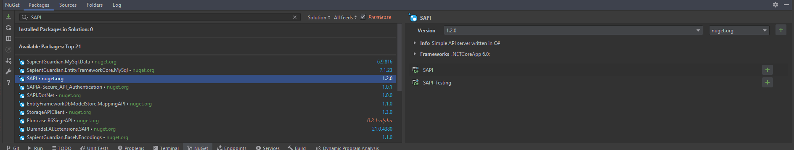

# SAPI - Simple API
SAPI is a library for creating APIs with C#. It's simple by design and allows for a lot of flexibility.

## Installation
Add as dependency in NuGet
```shell
Install-Package SAPI -ProjectName <project>
```
or in your preferred IDE:


you can also use SAPI by [downloading](https://github.com/Maciejowski2006/SAPI/releases) and referencing the DLL in your project.

## Usage
For detailed explanation You can also see wiki [wiki](https://github.com/Maciejowski2006/SAPI/wiki)
```csharp
// Program.cs
using SAPI;
using SAPI.Endpoints;
using Project.Endpoints;

public static void Main(string[] args)
{
    // Init SAPI
    Server sapi = new();
    
    // Mount endpoints(routes)
    sapi.MountEndpoint(new Ping());
    
    
    // Start SAPI
    sapi.Start();
}
```
```csharp
// Endpoints/Ping.cs
using System.Net;
using SAPI.Endpoints;
using SAPI.Utilities;

namespace Project.Endpoints
{
    public class Ping : IEndpoint
    {
        public string url { get; } = "ping";
        public Method method { get; } = Method.GET;

        public override void Task(ref HttpListenerRequest request, ref HttpListenerResponse response, Dictionary<string, string> parameters)
        {
            Console.WriteLine("Ping!");
            
            Utilities.HtmlResponse("Pong!", ref response);
        }
    }
}
```